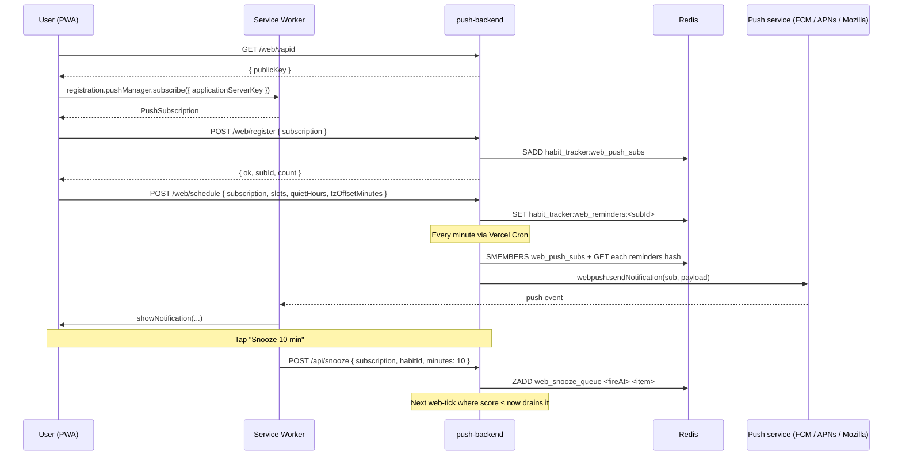

# Push Backend

A standalone Node.js server that sends notifications to **both** the Habitly
mobile app (via [`expo-server-sdk`](https://github.com/expo/expo-server-sdk-node))
and the Habitly PWA (via [`web-push`](https://github.com/web-push-libs/web-push)).

Deployed to **Vercel** (serverless) with all state in **Upstash Redis** and
three cron schedules: daily summary, weekly summary, and a once-per-minute
tick that fires PWA reminders honoring quiet hours.

Live: https://push-backend-xi.vercel.app

## Setup (local)

```bash
cd push-backend
npm install
cp .env.example .env
# Fill in UPSTASH_REDIS_REST_URL, UPSTASH_REDIS_REST_TOKEN, ADMIN_API_KEY,
# DEVICE_API_KEY, and the VAPID keys (see below).
npm run dev   # starts on http://localhost:4000
```

### Generate VAPID keys (Web Push)

The PWA needs the server's VAPID public key to subscribe.  Generate a
keypair **once per environment** (local + production):

```bash
npx web-push generate-vapid-keys
# {
#   "publicKey":  "B...",  ← paste into VAPID_PUBLIC_KEY
#   "privateKey": "...",   ← paste into VAPID_PRIVATE_KEY (server-only, NEVER ship to client)
# }
```

Then set the three env vars (locally in `.env`, in production on Vercel):

```bash
VAPID_PUBLIC_KEY=B...
VAPID_PRIVATE_KEY=...
VAPID_SUBJECT=mailto:you@example.com   # required by RFC 8292 — must be a mailto: or https: URL
```

If VAPID is not configured the server still accepts `/web/register` and
`/web/schedule` writes — only the actual `webpush.sendNotification` calls are
skipped (with a warning logged on startup).  This lets you stand up the
backend before generating keys.

## Endpoints

### Mobile (Expo)

| Method | Path                   | Auth        | Body                                                                  | Description                                                |
|--------|------------------------|-------------|-----------------------------------------------------------------------|------------------------------------------------------------|
| GET    | `/`                    | —           | —                                                                     | Admin dashboard UI (HTML).                                 |
| GET    | `/status`              | admin       | —                                                                     | Counts + token + sub list + cron schedule.                 |
| POST   | `/register`            | device      | `{ "token": "ExponentPushToken[..]" }`                                | Add a device's Expo push token to Redis (idempotent).      |
| POST   | `/unregister`          | device      | `{ "token": "ExponentPushToken[..]" }`                                | Remove a token (e.g., on logout).                          |
| POST   | `/send`                | admin       | `{ "title?", "body?", "data?", "imageUrl?", "to?": string[] }`        | Broadcast to all Expo tokens **and all web subs**, or only `to`. |
| GET    | `/api/daily-summary`   | cron/admin  | —                                                                     | Sends daily summary push (called by Vercel Cron 03:30 UTC).|
| POST   | `/api/daily-summary`   | admin       | `{ "title?", "body?" }`                                               | Manual daily-summary trigger from dashboard.               |
| GET    | `/api/weekly-summary`  | cron/admin  | —                                                                     | Sends weekly review push (Sunday 20:00 UTC).               |
| POST   | `/api/weekly-summary`  | admin       | `{ "title?", "body?" }`                                               | Manual weekly-summary trigger from dashboard.              |

### Web (PWA)

| Method | Path                   | Auth        | Body                                                                       | Description                                                                                            |
|--------|------------------------|-------------|----------------------------------------------------------------------------|--------------------------------------------------------------------------------------------------------|
| GET    | `/web/vapid`           | **public**  | —                                                                          | Returns `{ publicKey }` so the PWA can call `pushManager.subscribe({ applicationServerKey })`.         |
| POST   | `/web/register`        | device      | `{ "subscription": PushSubscription }`                                     | SADDs `JSON.stringify(subscription)` to `habit_tracker:web_push_subs`. Returns `{ ok, subId, count }`. |
| POST   | `/web/unregister`      | device      | `{ "subscription": PushSubscription }`                                     | SREMs the sub and DELs its reminders hash. Returns `{ ok, count }`.                                    |
| POST   | `/web/schedule`        | device      | `{ "subscription", "slots[]", "quietHours?", "tzOffsetMinutes" }`          | Replaces all per-sub reminders atomically. See [Schedule body](#schedule-body) below.                  |
| POST   | `/api/snooze`          | device      | `{ "subscription", "habitId", "minutes?": 10 }`                            | Queues a one-shot push 10 min (or `minutes`) from now. Returns `{ ok, subId, fireAt, minutes }`.       |
| GET    | `/api/web-tick`        | cron/admin  | —                                                                          | Vercel Cron every minute: fires due reminders + drains snooze queue. Returns `{ ok, scanned, sent, pruned }`. |

#### `PushSubscription` shape

Standard browser
[`PushSubscription.toJSON()`](https://developer.mozilla.org/en-US/docs/Web/API/PushSubscription/toJSON) output:

```jsonc
{
  "endpoint": "https://fcm.googleapis.com/fcm/send/c4WK...",
  "expirationTime": null,
  "keys": {
    "p256dh": "BPHy...",
    "auth":   "abc..."
  }
}
```

Validation rejects subs missing `endpoint` (must be a URL), `keys.p256dh`, or
`keys.auth` with HTTP 400.

#### `subId`

Derived server-side as the first 16 hex chars of the sha-256 of the endpoint:

```js
crypto.createHash('sha256').update(subscription.endpoint).digest('hex').slice(0, 16)
```

Stable across re-registrations of the same browser/subscription.

#### Schedule body

```jsonc
{
  "subscription": { "endpoint": "...", "keys": { "p256dh": "...", "auth": "..." } },

  "slots": [
    {
      "id":       "morning-water",       // stable string; used for last-fired dedupe
      "hour":     7,                      // 0–23, LOCAL clock time
      "minute":   30,                     // 0–59
      "weekdays": [2, 3, 4, 5, 6],        // OPTIONAL. Expo convention 1=Sun … 7=Sat.
                                          //          Empty / omitted = every day.
      "title":    "Time to drink water",
      "body":     "Tap to log a glass.",
      "data":     { "screen": "/habit", "habitId": "..." }
    }
  ],

  "quietHours": {                         // OPTIONAL — same shape as @quiet_hours_v1 in mobile app
    "enabled":     true,
    "startHour":   22,
    "startMinute": 0,
    "endHour":     7,
    "endMinute":   0
  },

  "tzOffsetMinutes": 330                  // POSITIVE = ahead of UTC. IST=+330, EST=-300.
                                          // Client sends: -new Date().getTimezoneOffset()
}
```

The cron tick combines `tzOffsetMinutes` with the current UTC time to get
the user's local hour/minute, matches against each slot, and fires if not in
quiet hours and not already fired for that minute (dedupe via per-slot
`lastFired` book-keeping inside the same Redis JSON blob).

### Auth headers

| Variable          | Required for                                                              | Sent as                                       |
|-------------------|---------------------------------------------------------------------------|-----------------------------------------------|
| `ADMIN_API_KEY`   | Dashboard, `/status`, `/send`, manual summary triggers, manual web-tick   | `X-Admin-Key` or `Authorization: Bearer ...`  |
| `DEVICE_API_KEY`  | `/register`, `/unregister`, `/web/register`, `/web/unregister`, `/web/schedule`, `/api/snooze` | `X-Device-Key`                                |
| `CRON_SECRET`     | Auto-injected by Vercel Cron on `GET /api/*-summary` and `/api/web-tick`  | `Authorization: Bearer <CRON_SECRET>`         |

If neither admin nor device keys are set, requests pass through (local-dev
fallback only — **always set these in production**).

## Cron schedule (`vercel.json`)

| Cron path              | Schedule (UTC)  | What it does                                                          |
|------------------------|-----------------|-----------------------------------------------------------------------|
| `/api/daily-summary`   | `30 3 * * *`    | 03:30 UTC = 09:00 IST. Sends yesterday's recap to all subs.           |
| `/api/weekly-summary`  | `0 20 * * 0`    | Sun 20:00 UTC. Sends weekly-review deep link.                         |
| `/api/web-tick`        | `* * * * *`     | Every minute. Fires due per-sub reminders + drains snooze queue.      |

## Send a test notification (cURL)

After at least one device has registered:

```bash
curl -X POST https://push-backend-xi.vercel.app/send \
  -H "Content-Type: application/json" \
  -H "X-Admin-Key: $ADMIN_API_KEY" \
  -d '{
    "title": "Time to drink water 💧",
    "body": "Tap to log it.",
    "data": { "screen": "/habit", "habitId": "<paste-a-habit-id>" }
  }'
```

Response includes `{ success, sent, webSent, webPruned, tickets }` — `sent`
counts Expo deliveries, `webSent` counts web-push deliveries, `webPruned`
counts dead web subs auto-removed during this send.

The `data.screen` + `data.habitId` payload is what the mobile
`handleNotificationResponse` listener and the PWA's `notificationclick`
handler use to deep-link the user to that habit's detail screen.

## Web Push lifecycle



## Snooze flow

The PWA's service-worker `notificationclick` handler with `event.action === 'SNOOZE'`
POSTs to `/api/snooze` with the current subscription, habit id, and an
optional `minutes` (defaults to 10).  The backend ZADDs an item with
`score = Date.now() + minutes*60_000` to `habit_tracker:web_snooze_queue`.
On every `/api/web-tick`, `ZRANGEBYSCORE 0 now` drains everything due, fires
each item once, and ZREMs it regardless of success (one-shot — no retries).

## Notes

- **All state lives in Upstash Redis** so restarts and serverless cold starts
  do not wipe tokens, subs, or reminder schedules.
- **Expo `DeviceNotRegistered` handling** is automatic — after every send the
  server polls Expo's receipts endpoint 15 s later and `SREM`s any tokens that
  come back with that error.
- **Web push 404/410 handling** is synchronous — the response code is checked
  inline in `sendWebPush`, and dead subs are SREM'd plus their reminders hash
  DEL'd in the same request.
- **iOS Safari**: Web Push only works when the PWA is installed to the home
  screen (`navigator.standalone === true`) on iOS 16.4+.  The PWA service
  worker MUST call `showNotification` on every push event or Apple revokes the
  subscription — see `webapp/src/service-worker/push-worker.ts`.
- **Remote Expo push** requires a physical device and a development/release
  build (not Expo Go on Android since SDK 53).
- `EXPO_ACCESS_TOKEN` is only required if you enabled enhanced push security
  on your Expo account.
